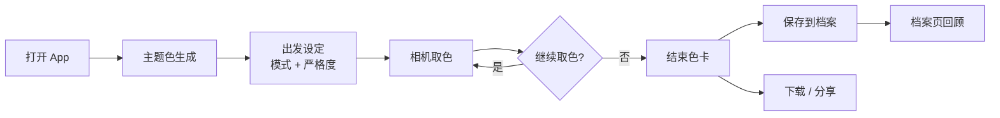
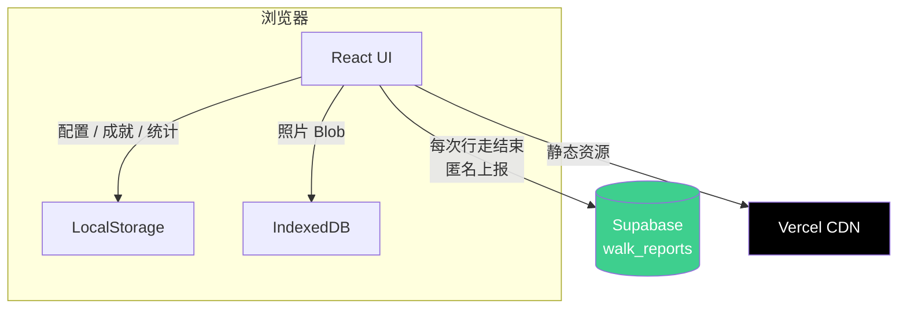

<div align="center">

# Color Walk · 色彩漫步

**在世界里收集颜色**

[Live Demo](https://color-walk-sable.vercel.app) · 
[项目简介](#-关于) · 
[设计理念](#-设计理念) · 
[本地开发](#-本地开发) · 
[Roadmap](#-roadmap)

</div>

---

## 📑 目录

- [关于](#-关于)
- [设计理念](#-设计理念)
- [功能](#-功能)
- [用户流程](#-用户流程)
- [技术栈](#-技术栈)
- [系统架构](#-系统架构)
- [数据模型](#-数据模型)
- [安全设计](#-安全设计)
- [成就系统](#-成就系统)
- [多语言](#-多语言)
- [本地开发](#-本地开发)
- [目录结构](#-目录结构)
- [Roadmap](#-roadmap)
- [FAQ](#-faq)
- [致谢](#-致谢)
- [License](#-license)
- [作者](#-作者)

---

## 🌿 关于

Color Walk 是一个把"出门散步"变成色彩收集游戏的 Web App。

每次行走从一组主题色开始。App 在你出门前生成今天的渐变色卡——可能是"月白→紫黛",也可能是"草绿→自定义色带"。带着它出门,用摄像头对准生活里的颜色:墙皮、咖啡、地铁的椅子、傍晚的云。当你按下快门,App 会判断这个颜色和今日主题的匹配程度,把它收进你的色卡档案里。

### 为什么做这个

作者 ADHD,从小对色彩异常敏感——会因为某面墙的灰是"刚刚好的灰"而停下脚步,也会因为一片云的粉调不对而感觉别扭。色感是一种很私人的感知力,但市面上几乎没有一个 App 能放大、记录、回放这种感知。

于是有了 Color Walk:它不是工具,也不是社交平台。它是一面镜子,把你对颜色的注意力变成可以保存、回顾的东西。

### 关于"Color Walk"这个概念

"Color Walk"作为一种艺术与正念练习,可以追溯到 1970 年代美国作家 William Burroughs 的教学——他在课堂上让学生"在街道上挑出所有的红,然后切换到蓝、绿、黄,你会发现颜色开始自己变得鲜明"。这个练习近年来在 TikTok 上重新流行,也催生了几个同类产品,包括 ColorWalk - A Color Journey(iOS)、컬러워크(Android)、PatchWalk(iOS)等。

本项目是这个概念的另一种实现。相比已有产品,这里做了几个不同选择:

- 反社交、反排名、反分享(对比 PatchWalk 的分享驱动定位)
- 中文母语色名系统(月白 / 烟墨 / 霁青)
- 三档严格度,从随意散步到色感挑战
- Web 跨平台 + 四语言支持

### 在线访问

🌐 **https://color-walk-sable.vercel.app**

### 截图

<!-- 截图待补 -->

| 主题色 | 相机取色 | 结束色卡 | 档案 |
|:---:|:---:|:---:|:---:|
|  |  |  |  |

---

## 🎋 设计理念

Color Walk 是一个**反社交、反排名、反分享**的小游戏。这不是没做完,是产品的核心选择。

### 静默游戏(Silent Game)

它不催你出门,不奖励你坚持,不让你跟别人比谁收的色更多。你走多久、走多远、取多少色,都不会被看见、不会被排名、不会被分享出去。色卡保存在你自己的档案里,只属于你。

### 慢节奏 · 不催促 · 不上瘾

没有连续打卡红点,没有"今日目标未完成"的提醒,没有强迫你回来的机制。如果你一周没打开它,它不会发任何通知。它的存在只是为了让你在某个普通的下午,想出去走走的时候,带一组颜色出门。

### 留白美学

色名取自月白、烟墨、霁青、绛紫这类具有古意的中文色彩词汇,界面使用纸本色调和明朝体字体,过渡动效参考水墨涟漪。三种严格度的命名也来自同一气质:

- **氛围(Ambient)** — 宽容地匹配色调,适合随意散步
- **猎人(Hunter)** — 精准追踪颜色,适合带着目标出门
- **精准(Precise)** — 0–100 分数评分,适合想挑战自己色感的时刻

---

## 🌊 功能

### 出发前
- 每日自动生成一组主题渐变色,带水墨涟漪动效
- 可选三种模式:单色追踪 / 自由模式
- 可选三种严格度:氛围 / 猎人 / 精准

### 行走中
- 摄像头实时取色,中央取色环显示当前颜色
- 实时显示 HEX、RGB、中文色名
- 精准模式下显示与主题色的匹配分数

### 结束后
- 自动生成色卡:单色模式为照片+主色,自由模式为多色组合
- 支持下载到本地相册
- 支持原生分享(Web Share API)
- 解锁成就时显示水墨风格弹窗

### 长期使用
- 档案页保存所有历次行走,可按色卡或照片视图浏览
- 24 个隐藏成就,分布于 5 类
- 设置页提供累计统计:总行走次数 / 总取色数 / 总时长 / 最常用模式

---

## 🌀 用户流程



---

## 🛠 技术栈

**前端**
- React · Vite · Motion(动效)

**本地存储**
- LocalStorage(配置、成就、统计)
- IndexedDB(照片,自动同步清理)

**后端**
- Supabase(匿名行为统计,Row Level Security 保护)

**部署**
- Vercel(自动 CI/CD)

---

## 🏛 系统架构



数据流原则:
- 用户产生的内容(照片、色卡、成就)只存本地,不上传
- 上报到 Supabase 的只有匿名统计数据,无 PII
- Supabase 端启用 RLS,前端只能写、不能读,即使 API key 泄露也无法窃取数据

---

## 📊 数据模型

### Supabase: `walk_reports` 表

| 字段 | 类型 | 约束 | 说明 |
|---|---|---|---|
| `id` | uuid | PK, 自动生成 | 行 ID |
| `session_id` | uuid | NOT NULL | 一次行走的匿名 ID(前端 `crypto.randomUUID()`) |
| `mode` | text | `'single' \| 'multi'` | 模式 |
| `strictness` | int | `1-5` | 严格度等级(ambient=1, hunter=2, precise=3) |
| `duration_sec` | int | `5-86399` | 行走时长(秒) |
| `color_count` | int | `1-200` | 取到的颜色数量 |
| `language` | text | `'zh' \| 'en' \| 'ja' \| 'ko'` | UI 语言 |
| `created_at` | timestamptz | DEFAULT now() | 写入时间 |

### Row Level Security 策略

```sql
-- 仅允许 anon / authenticated 角色 INSERT
create policy "anyone can insert walk reports"
  on public.walk_reports
  for insert
  to anon, authenticated
  with check (true);

-- 不创建 select / update / delete policy
-- → RLS 默认拒绝,前端无法读取/修改/删除任何数据
```

### CHECK 约束(防垃圾灌入)

表上配置了 5 条 CHECK 约束,无效数据(时长<5 秒、取色数为 0、不支持的语言等)会被数据库直接拒收。

---

## 🔒 安全设计

| 防线 | 实现 |
|---|---|
| CSP(内容安全策略) | `index.html` meta 标签,严格限制 connect-src / script-src / style-src,只放行 supabase.co 通配符 |
| XSS 防御 | DOMPurify 对用户输入递归过滤 |
| 照片隐私 | IndexedDB 存储,删除行走记录时同步清理对应照片(防孤儿数据) |
| 成就反作弊 | 解锁记录经过完整性校验,防止本地数据篡改 |
| 构建安全 | Source Map 关闭,生产代码不暴露源码结构 |
| 依赖卫生 | `npm audit` 零漏洞,移除所有未使用依赖 |
| Supabase RLS | Insert-only,陌生人拿到 publishable key 也无法读取任何数据 |
| 环境变量 | `.env.local` 严格 gitignore,Vercel 后台单独配置 |

---

## 🏆 成就系统

24 个隐藏成就,分布在 5 个分类。解锁时显示水墨风格弹窗,不分享、不上传、只存在你的档案里。

| 分类 | 主题 | 数量 |
|---|---|---|
| **启程** | 首次出门、首次解锁不同模式、首次取色 | 5 |
| **凝视** | 在精准模式下捕捉到接近完美匹配的颜色 | 4 |
| **坚持** | 连续打卡、累计行走天数 | 4 |
| **时令** | 在特定时段(清晨 / 深夜)、特定季节出门 | 5 |
| **积累** | 总行走次数、总取色数、总时长的里程碑 | 6 |

具体解锁条件不在 README 公开——留给用户自己探索。

---

## 🌐 多语言

支持四种语言:简体中文 · English · 日本語 · 한국어

UI 文本通过 Context 管理,所有翻译键集中在 `src/contexts/LanguageContext.jsx`。

色名翻译的特殊性:中文色名(如"月白"、"霁青")是 Color Walk 的核心美学元素,本质上无法精确翻译——"月白"在英文里没有对应的传统色名。在英/日/韩版本中,色名采用了"音译 + 含义注释"的折中方案,而非强行替换为现代色名。

---

## ⚙ 本地开发

### 环境

- Node.js 18+
- npm

### 启动

```bash
npm install
npm run dev
```

默认端口 `http://localhost:3000`。

### 配置 Supabase

App 会向 Supabase 上报一次行走的匿名统计数据。所有数据无用户标识,不配置也能跑(只是不会上报)。

在项目根目录创建 `.env.local`:

```
VITE_SUPABASE_URL=https://your-project.supabase.co
VITE_SUPABASE_PUBLISHABLE_KEY=sb_publishable_xxxxxxxxxxxx
```

两个值在 Supabase Dashboard → Project Settings → API 里:

- `VITE_SUPABASE_URL` — Project URL
- `VITE_SUPABASE_PUBLISHABLE_KEY` — Publishable key,以 `sb_publishable_` 开头

不要用 secret key(`sb_secret_` 开头),那是后端用的。

### 部署到 Vercel

环境变量要在 Vercel Dashboard 单独配一次,`.env.local` 不会自动同步。Project Settings → Environment Variables,加上面两个变量。

---

## 📁 目录结构

```
src/
├── lib/             Supabase 客户端、上报函数
├── pages/           页面(主题色、出发设定、相机、结束色卡、档案、成就、设置)
├── components/      通用组件
├── contexts/        Context(语言、主题、BGM)
├── utils/           工具(存储、成就、统计、导出)
└── assets/          静态资源(色彩词典、音频、图标)

public/              静态文件
docs/screenshots/    README 截图(待补)
```

---

## 🗺 Roadmap

### 一期(已完成)
- [x] 主题色生成 + 三种模式 + 三种严格度
- [x] 相机取色 + 实时色名识别
- [x] 单色 / 多色结束色卡
- [x] 档案系统(照片视图 / 色卡视图)
- [x] 24 成就系统 + 水墨弹窗
- [x] 环境音乐(两首交替循环)
- [x] 本地统计与色彩报告
- [x] 四语言支持
- [x] 安全加固(CSP / DOMPurify / IndexedDB 同步清理)
- [x] Supabase 匿名上报 + RLS + CHECK 约束
- [x] Vercel 自动部署

### 二期(规划中)
- [ ] UI 美化(动效细化、视觉重构)
- [ ] 日历视图档案(每日色卡渲染为日历上的彩色圆点,情感化数据可视化)
- [ ] 本地数据看板(读取 Supabase 数据展示行走分布统计)
- [ ] 色彩报告深度化(色谱拼图、年度回顾)

### 未来
- [ ] iOS 上架(需 Mac + Apple Developer 账号)
- [ ] Android 适配

---

## ❓ FAQ

**Q:没有摄像头能用吗?**

A:不能。Color Walk 的核心交互是用摄像头取色,没有摄像头的设备无法完成行走流程。如果你的浏览器拒绝了摄像头权限,App 会停在相机页等待权限。

**Q:我的照片存在哪?会被上传吗?**

A:照片只存在你自己浏览器的 IndexedDB 里,不会上传到任何服务器。如果你删除浏览器数据或换设备,照片会丢失(App 不做云同步)。

**Q:数据隐私如何保护?**

A:Color Walk 是本地优先的 App。除了行走结束时向 Supabase 发送一次匿名统计(模式 / 严格度 / 时长 / 取色数量 / UI 语言 / 一次性 UUID)外,不会上传任何其他数据——不上传照片、不上传具体颜色值、不上传位置、不上传设备信息、不收集任何能识别你身份的信息。Supabase 端开启了 Row Level Security,即使有人拿到前端 API key 也无法读取任何已写入的数据。

**Q:离线能用吗?**

A:核心功能可以(主题色、相机、色卡、档案都不依赖网络)。只有匿名上报这一步会在离线时静默失败,不影响使用。

**Q:为什么没有分享 / 排行榜功能?**

A:这是产品的核心选择,不是没做完。社交、排名、分享驱动的 App 已经够多了——我们打开手机的每一秒,几乎都在被某种数字追逐:点赞数、关注数、连续打卡天数。Color Walk 想反过来:它不催你出门、不奖励你坚持、不让你跟别人比谁收的色更多。它的存在只是为了让你在某个普通的下午,想出去走走的时候,带一组颜色出门。

---

## 📚 致谢

核心依赖:

- [React](https://react.dev/) · [Vite](https://vitejs.dev/) · [Motion](https://motion.dev/)
- [Supabase](https://supabase.com/) · [Vercel](https://vercel.com/)
- [DOMPurify](https://github.com/cure53/DOMPurify) · [Lucide Icons](https://lucide.dev/)

---

## 📄 License

未经授权,请勿用于商业用途。

---

## 🙋 作者

**dustilayer** · [GitHub](https://github.com/dustilayer)

如果你觉得 Color Walk 让你重新看了一眼世界,欢迎在 GitHub 上 star ⭐ 这个项目。
